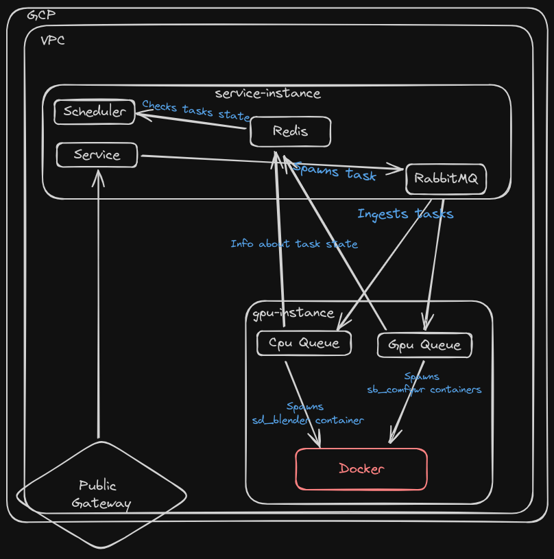

# Deployment
## Prerequisites
- Docker
- GCloud CLI

You must be logged into gcloud: 
```bash
gcloud auth login
```
You must configure docker to use gcloud as auth provider: 
```bash
gcloud auth configure-docker europe-central2-docker.pkg.dev
```

Note: some of the scripts use ssh, GCP VMs create different users for different Google Cloud Accounts.
To use those scripts you many need to add your ssh key to the instance and change username inside the script to yours.
For most of the scripts it's also possible to override username with `USERNAME` env variable, e.g.: `USERNAME=another-user ./deploy.sh`

## Building sd_blender and sd_comfywr images
To build "local" blender and comfywr images and copy required code for them to run in cloud run: 
```bash
./images/build.sh
```

By default, it expects sd_experiments repository to be on the same level as this one, e.g.:
```
├── Projects
│   ├── sd_experiments
│   ├── MVD-deployment
```
If sd_experiments repository is placed in a different place use SD_EXPERIMENTS_HOME environment variable to point to it, e.g.:
```bash
SD_EXPERIMENTS_HOME=/path/to/sd_experiments ./images/build.sh
```
This script will also push built images to GCP Artifact Repository 
`europe-central2-docker.pkg.dev/unitydiffusion/sd-experiments`

## Deploying images to instances running queues
By default, images are not being updated on instance(s) where they are used 
To update them you need to:
1. Configure docker to auth gcloud as auth provider on remote instance(s), if not already configured
```bash
gcloud auth configure-docker europe-central2-docker.pkg.dev
```
2. Run script
```bash
./images/deploy.sh
```

This script contains variables with ip addresses pointing to instances that run `cpu-queue` and `gpu-queue`.
If for any reason ip address changed of queues changes, or new instance(s) is added - update them accordingly

## Adding new handlers for cpu-queue and gpu-queue
1. Firstly create a new instance, of desired type
2. If that instance is meant to run gpu-queue, you need to install [GPU Drivers](https://cloud.google.com/compute/docs/gpus/install-drivers-gpu#install-script) and [NVIDIA Container Toolkit](https://docs.nvidia.com/datacenter/cloud-native/container-toolkit/latest/install-guide.html)
<br> Note: There was an issue with installation of NVIDIA GPU Drivers on kernel version 6.1.0-18, to fix it downgrade kernel to 6.1.0.-17  
3. Update `service/deploy/swarm-config.json` file to add new instance to cluster and mark it as either cpu-queue, gpu-queue or both. 
4. Run `service/deploy/prepare-swarm.js` script to update cluster with new config.
5. After that Docker should automatically spawn new instance of cpu-queue and\or gpu-queue on new instance. If it didn't run `./service/deploy/deploy.sh` script to redeploy.

# Development
## Prerequisites
- Python 3.11
- Pipenv

# Service Overview

